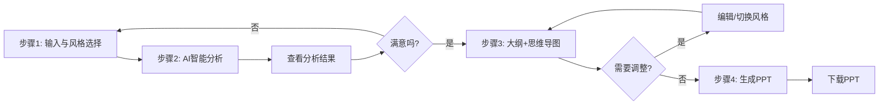

# Mind in PPT - 产品需求文档 (PRD)

> **文档版本**: v2.0
> **创建日期**: 2025-02-07
> **产品类型**: AI驱动的演示文稿生成工具
> **目标用户**: 需要快速制作专业PPT的职场人士
> **项目状态**: 待开发确认

---

## 📋 目录

1. [产品概述](#一产品概述)
2. [核心价值主张](#二核心价值主张)
3. [用户画像](#三用户画像)
4. [用户故事](#四用户故事)
5. [完整工作流程](#五完整工作流程)
6. [界面设计规范](#六界面设计规范)
7. [技术架构](#七技术架构)
8. [数据结构](#八数据结构)
9. [API接口设计](#九api接口设计)
10. [演示风格系统](#十演示风格系统)
11. [智能素材推荐](#十一智能素材推荐)
12. [实施计划](#十二实施计划)
13. [成功指标](#十三成功指标)
14. [风险评估](#十四风险评估)

---

## 一、产品概述

### 1.1 产品定位

**Mind in PPT** 是一款 AI 驱动的演示文稿自动生成工具，通过智能分析用户输入的文本内容，自动提取核心观点、生成结构化大纲和思维导图，并一键导出专业 PPT。

### 1.2 核心功能

- ✨ **智能文本分析**: AI 深度分析文本，提取核心主题和关键要点
- 📊 **结构化大纲**: 自动生成层次清晰的演示大纲
- 🎨 **思维导图可视化**: 实时预览内容逻辑结构
- 🤖 **智能素材推荐**: 自动推荐图标、布局和视觉建议
- 💼 **场景化风格**: 15种职场场景风格可选
- 📥 **一键生成PPT**: 应用所有视觉建议，导出可用文件

### 1.3 产品愿景

> **让每个人都能快速制作专业的演示文稿**

---

## 二、核心价值主张

### 2.1 对用户的价值

| 痛点 | 解决方案 | 价值 |
|------|----------|------|
| ❌ 制作PPT耗时数小时 | ✅ AI自动生成，只需几分钟 | 🚀 **效率提升100倍** |
| ❌ 不擅长内容组织 | ✅ AI自动提取核心观点 | 🧠 **逻辑清晰有结构** |
| ❌ 设计能力不足 | ✅ 智能推荐图标和布局 | 🎨 **专业视觉效果** |
| ❌ 不知道用什么风格 | ✅ 15种场景化风格可选 | 💼 **适配各种场合** |
| ❌ 思维导图和PPT脱节 | ✅ 大纲和思维导图实时同步 | 🔄 **可视化理解内容** |

---

## 三、用户画像

### 3.1 主要用户群体

#### 👤 用户A: 产品经理
- **场景**: 每周向高管汇报工作进展
- **痛点**: 没时间做PPT，设计不专业
- **需求**: 快速生成专业汇报PPT
- **偏好**: 高管汇报风格

#### 👤 用户B: 企业培训师
- **场景**: 准备培训课件和教学材料
- **痛点**: 内容多，结构难梳理
- **需求**: 清晰的教学大纲和可视化
- **偏好**: 培训教学风格

#### 👤 用户C: 项目经理
- **场景**: 项目里程碑汇报
- **痛点**: 需要展示进度和数据
- **需求**: 突出数据和成果
- **偏好**: 项目进展风格

#### 👤 用户D: 创业者
- **场景**: 投融资路演
- **痛点**: 要打动投资人
- **需求**: 冲击力强的视觉效果
- **偏好**: 投融资路演风格

---

## 四、用户故事

### Story 1: 快速生成汇报PPT
> **作为** 产品经理，我需要每周向高管汇报工作进展
> **我想要** 只输入工作内容，就自动生成专业的汇报PPT
> **这样** 我就能节省时间专注于产品本身，同时保证汇报质量

**验收标准**:
- [ ] 5分钟内完成PPT生成
- [ ] 大纲结构清晰合理
- [ ] 视觉效果专业

---

### Story 2: 可视化理解内容
> **作为** 用户，我输入了一大段文字
> **我想要** 同时看到大纲和思维导图
> **这样** 我就能更好地理解内容的逻辑结构，确认没有遗漏

**验收标准**:
- [ ] 左侧显示大纲，右侧显示思维导图
- [ ] 两者实时同步更新
- [ ] 思维导图可以缩放、拖拽

---

### Story 3: 场景化风格选择
> **作为** 用户，我需要在不同场合做演示
> **我想要** 根据演示场合选择合适的风格
> **这样** PPT就能更好地匹配我的受众和场景

**验收标准**:
- [ ] 有15种场景化风格可选
- [ ] 下拉菜单方式选择
- [ ] 切换风格后实时预览效果

---

### Story 4: 智能素材推荐
> **作为** 用户，我不擅长设计
> **我想要** AI 为我推荐合适的图标和布局
> **这样** 即使没有设计基础，也能做出专业的PPT

**验收标准**:
- [ ] 每个章节都有推荐的图标
- [ ] 有具体的视觉设计建议
- [ ] 图标和配色根据风格自动适配

---

## 五、完整工作流程

### 5.1 四步工作流总览



### 5.2 步骤1: 输入与风格选择

**界面展示**:

```
┌────────────────────────────────────────────────────────┐
│  🧠 Mind in PPT                           [关于] [帮助] │
├────────────────────────────────────────────────────────┤
│  进度: ● 输入 → ○ 分析 → ○ 确认 → ○ 生成              │
├────────────────────────────────────────────────────────┤
│                                                        │
│  👋 欢迎使用 Mind in PPT！                             │
│                                                        │
│  请粘贴或输入您的文本内容，我们将帮您生成专业的 PPT    │
│                                                        │
│  ┌────────────────────────────────────────────────┐    │
│  │  📌 演示风格（下拉菜单）                    │    │
│  │  ┌────────────────────────────────────────┐    │    │
│  │  │ [选择演示风格 ▼]                       │    │    │
│  │  │  📊 商务汇报类 (3种)                     │    │    │
│  │  │  💼 职场办公类 (3种)                     │    │    │
│  │  │  🎤 行业交流类 (3种)                     │    │    │
│  │  │  💡 创意脑暴类 (2种)                     │    │    │
│  │  │  📚 学术教育类 (2种)                     │    │    │
│  │  │  🚀 产品发布类 (2种)                     │    │    │
│  │  └────────────────────────────────────────┘    │    │
│  │                                              │    │
│  │  提示: 根据演示场景选择合适的风格            │    │
│  └────────────────────────────────────────────────┘    │
│                                                        │
│  ┌────────────────────────────────────────────────┐    │
│  │  📝 输入您的文本                              │    │
│  │  ┌────────────────────────────────────────┐    │    │
│  │  │                                         │    │    │
│  │  │  请输入或粘贴您想要转换的文本内容...    │    │    │
│  │  │                                         │    │    │
│  │  │                                         │    │    │
│  │  │                                         │    │    │
│  │  └────────────────────────────────────────┘    │    │
│  │                                              │    │
│  │  最少 50 字符，最多 5000 字符                 │    │
│  └────────────────────────────────────────────────┘    │
│                                                        │
│           [ 📊 智能分析 ]                             │
│                                                        │
└────────────────────────────────────────────────────────┘
```

---

### 5.3 步骤2: AI 智能分析

**阶段 1: 分析中**

```
┌────────────────────────────────────────────────────────┐
│  🧠 Mind in PPT                           [关于] [帮助] │
├────────────────────────────────────────────────────────┤
│  进度: ● 输入 → ○ 分析 → ○ 确认 → ○ 生成              │
├────────────────────────────────────────────────────────┤
│                                                        │
│  ✨ AI 正在分析您的文本...                            │
│                                                        │
│  ┌────────────────────────────────────────────────┐    │
│  │  [加载动画]                                    │    │
│  │                                               │    │
│  │   正在提取核心主题和关键要点...                │    │
│  │                                               │    │
│  │   ⏳ 预计需要 3-5 秒                          │    │
│  │                                               │    │
│  └────────────────────────────────────────────────┘    │
│                                                        │
└────────────────────────────────────────────────────────┘
```

**阶段 2: 分析完成（基于用户输入的实际内容）**

```
┌────────────────────────────────────────────────────────┐
│  🧠 Mind in PPT                           [关于] [帮助] │
├────────────────────────────────────────────────────────┤
│  进度: ● 输入 → ● 分析 → ○ 确认 → ○ 生成              │
├────────────────────────────────────────────────────────┤
│                                                        │
│  ✅ 分析完成！以下是 AI 对您内容的分析：               │
│                                                        │
│  ┌────────────────────────────────────────────────┐    │
│  │  📊 核心主题                                  │    │
│  │  [AI 提取的用户内容核心主题 - 例如:]              │    │
│  │  "提升产品用户体验的三种策略"                  │    │
│  │                                               │    │
│  │  这是根据您输入的文本内容，AI 识别出的      │    │
│  │  最核心的主题                                  │    │
│  └────────────────────────────────────────────────┘    │
│                                                        │
│  ┌────────────────────────────────────────────────┐    │
│  │  🔑 关键要点（AI 提取了 N 个要点）           │    │
│  │  • [AI 提取的要点1 - 实际内容]              │    │
│  │  • [AI 提取的要点2 - 实际内容]              │    │
│  │  • [AI 提取的要点3 - 实际内容]              │    │
│  │  • [AI 提取的要点4 - 实际内容]              │    │
│  │  • [AI 提取的要点5 - 实际内容]              │    │
│  └────────────────────────────────────────────────┘    │
│                                                        │
│  ┌────────────────────────────────────────────────┐    │
│  │  📐 结构建议                                  │    │
│  │  AI 建议: [X] 个章节，约 [Y] 张幻灯片       │    │
│  │  内容复杂度: [简单/中等/复杂]                │    │
│  │  推荐章节:                                    │    │
│  │  • [建议章节1]                                │    │
│  │  • [建议章节2]                                │    │
│  │  • [建议章节3]                                │    │
│  │                                               │    │
│  └────────────────────────────────────────────────┘    │
│                                                        │
│  ┌────────────────────────────────────────────────┐    │
│  │  💡 AI 建议                                   │    │
│  │  根据您的内容特点，AI 建议:                  │    │
│  │  • 采用"[选定的风格]"风格                    │    │
│  │  • 重点突出: [重点方向1]、[重点方向2]      │    │
│  │  • 建议使用: [数据展示/案例分析/流程图等]    │    │
│  └────────────────────────────────────────────────┘    │
│                                                        │
│  [ ← 返回修改输入 ]    [ ✓ 确认并生成大纲 ]         │
│                                                        │
└────────────────────────────────────────────────────────┘
```

---

### 5.4 步骤3: 大纲 + 思维导图（核心）⭐

**界面布局**: 左右分屏

```
┌─────────────────────────────────────────────────┐
│  📋 结构化大纲              🎨 思维导图      │
│  ┌─────────────────────┐   ┌───────────────┐  │
│  │ 标题栏              │   │               │  │
│  │ [切换风格 ▼]       │   │  [+][-][⟲]  │  │
│  │ ↑ 顶部工具栏        │   │  工具栏       │  │
│  ├─────────────────────┤   │               │  │
│  │                     │   │               │  │
│  │ 1. 市场分析       │   │   [思维导图]   │  │
│  │    💡             │   │               │  │
│  │    ┌─────────────┐ │   │               │  │
│  │    │智能建议卡片: │ │   │               │  │
│  │    │• 建议使用图表│ │   │               │  │
│  │    │• 推荐布局:   │   │               │  │
│  │    │  左右对比   │ │   │               │  │
│  │    └─────────────┘ │   │               │  │
│  │    • 数据展示      │   │               │  │
│  │    • 趋势分析      │   │               │  │
│  │                     │   │               │  │
│  │ 2. 产品创新       │   │               │  │
│  │    🎯             │   │               │  │
│  │    [智能建议...]   │   │               │  │
│  │    • AI 技术       │   │               │  │
│  │    • 性能提升      │   │               │  │
│  │                     │   │               │  │
│  │ 3. 团队协作       │   │               │  │
│  │    👥             │   │               │  │
│  │    [智能建议...]   │   │               │  │
│  │                     │   │               │  │
│  │ [...]             │   │               │  │
│  │                     │   │               │  │
│  └─────────────────────┘   └───────────────┘  │
│                                               │
│  💡 智能提示: 点击章节标题可查看详细建议    │
│                                               │
│  [ ← 返回分析 ]    [ ← 重新生成 ]    [ ✓ 生成 PPT ]  │
└─────────────────────────────────────────────────┘
```

**核心功能**:

1. **左右分屏展示**
   - 左侧：大纲（可编辑）
   - 右侧：思维导图（实时同步）

2. **风格切换**
   - 顶部下拉菜单，切换后两者同步更新
   - 300ms 平滑过渡动画

3. **智能建议**
   - 每个章节显示推荐图标
   - 可展开查看详细视觉建议

4. **实时同步**
   - 修改大纲 → 思维导图自动更新
   - 切换风格 → 两者同时更新

---

### 5.5 步骤4: 生成PPT

```
┌────────────────────────────────────────────────────────┐
│  🧠 Mind in PPT                           [关于] [帮助] │
├────────────────────────────────────────────────────────┤
│  进度: ● 输入 → ● 分析 → ● 确认 → ● 生成              │
├────────────────────────────────────────────────────────┤
│                                                        │
│  ⏳ 正在生成您的 PPT...                               │
│                                                        │
│  ┌────────────────────────────────────────────────┐    │
│  │  正在应用智能素材建议...             │    │
│  [████████████████░░] 80%                    │    │
│  │                                              │    │
│  │  • 已应用 15 个智能图标推荐           │    │
│  │  • 已优化布局和配色                   │    │
│  │  • 已生成 15 张幻灯片                │    │
│  │                                              │    │
│  │  预计还需要 5-10 秒...                 │    │
│  └────────────────────────────────────────────────┘    │
│                                                        │
└────────────────────────────────────────────────────────┘
```

**生成完成后**:

```
🎉 PPT 生成成功！

┌────────────────────────────────────────────────┐
│  ✨ 您的 PPT 已准备就绪！                        │
│                                                    │
│  📊 15 张幻灯片                                │
│  🎨 高管汇报风格                              │
│  🤖 已应用智能素材推荐                          │
│                                                    │
│  ┌────────────────────────────────────────┐  │
│  │  文件名: [标题].pptx                     │  │
│  │  文件大小: 2.5 MB                         │  │
│  │                                             │  │
│  │  [ 📥 下载 PPT ]                           │  │
│  └────────────────────────────────────────┘  │
│                                                    │
│  [ ← 返回修改大纲 ]    [ 🔄 创建新的 PPT ]        │
└────────────────────────────────────────────────┘
```

---

## 六、界面设计规范

### 6.1 整体布局

```
┌────────────────────────────────────────────────────────┐
│  顶部导航栏 (60px)                                     │
│  Logo | 标题 | [关于] [帮助]                         │
├────────────────────────────────────────────────────────┤
│                                                        │
│  进度指示器 (40px)                                     │
│  ○ 输入 → ○ 分析 → ○ 确认 → ○ 生成                    │
│                                                        │
│  主内容区域 (自适应高度)                               │
│  ┌────────────────────────────────────────────────┐    │
│  │                                                │    │
│  │         [当前步骤的组件内容]                  │    │
│  │                                                │    │
│  │                                                │    │
│  └────────────────────────────────────────────────┘    │
│                                                        │
│  操作按钮区 (80px)                                     │
│  [← 上一步]    [下一步 →]                             │
│                                                        │
└────────────────────────────────────────────────────────┘
```

---

### 6.2 进度指示器设计

```typescript
<ProgressIndicator
  steps={[
    { key: 'input', label: '输入', icon: '📝' },
    { key: 'analysis', label: '分析', icon: '🔍' },
    { key: 'review', label: '确认', icon: '✓' },
    { key: 'generate', label: '生成', icon: '📊' }
  ]}
  currentStep={currentStep}
/>
```

**样式**:
- 当前步骤: 实心圆，主题色
- 已完成步骤: 实心圆，绿色
- 未完成步骤: 空心圆，灰色

---

## 七、技术架构

### 7.1 技术栈

**前端框架**:
- Next.js 16.1 (App Router)
- React 19.2
- TypeScript 5.x
- Tailwind CSS 4.x

**图标库**:
- Lucide React (1000+ 图标)

**思维导图**:
- Markmap-view 0.15.x
- Markmap-lib 0.18.x
- D3.js 7.x

**PPT生成**:
- PptxGenJS 4.0.x

**AI服务**:
- 智谱 AI GLM-4

---

### 7.2 目录结构

```
src/
├── app/                          # Next.js App Router
│   ├── page.tsx                   # 主页面（工作流入口）
│   ├── layout.tsx                  # 根布局
│   ├── globals.css                 # 全局样式
│   └── api/                       # API Routes
│       ├── analyze-text/           # 智能分析 API
│       ├── generate-outline/         # 生成大纲 API
│       └── generate-ppt/            # 生成 PPT API
│
├── components/                   # React组件
│   ├── workflow/                  # 工作流组件
│   │   ├── WorkflowContainer.tsx    # 工作流容器
│   │   ├── StepInput.tsx            # 步骤1: 输入
│   │   ├── StepAnalysis.tsx         # 步骤2: 分析结果
│   │   ├── StepReview.tsx           # 步骤3: 大纲+思维导图
│   │   └── StepComplete.tsx         # 步骤4: 生成PPT
│   │
│   ├── common/                     # 通用组件
│   │   ├── ProgressIndicator.tsx     # 进度指示器
│   │   ├── LoadingSpinner.tsx        # 加载动画
│   │   └── ErrorAlert.tsx           # 错误提示
│   │
│   ├── StyleSelector.tsx             # 风格选择器（下拉菜单）
│   ├── TextInput.tsx                # 文本输入组件
│   ├── OutlineView.tsx               # 大纲视图
│   ├── LogicVisualizer.tsx           # 思维导图组件
│   ├── SmartIcon.tsx                 # 智能图标组件
│   └── Header.tsx / Footer.tsx
│
├── lib/                          # 工具库
│   ├── types.ts                     # TypeScript类型定义
│   ├── styles.ts                    # 风格配置（15种）
│   ├── iconRecommendation.ts         # 图标推荐引擎
│   ├── promptGenerator.ts            # AI Prompt生成器
│   ├── markmapConverter.ts           # 大纲转思维导图
│   └── utils.ts                     # 工具函数
│
└── hooks/                        # React Hooks
    ├── useWorkflow.ts              # 工作流状态管理
    ├── useAnalysis.ts              # 分析逻辑
    ├── useOutline.ts                # 大纲生成
    └── usePPT.ts                    # PPT生成
```

---

## 八、数据结构

### 8.1 核心数据类型

```typescript
// ==================== 工作流状态 ====================

type WorkflowState =
  | 'input'           // 步骤1: 输入和风格选择
  | 'analyzing'       // 步骤2: AI分析中
  | 'analysisReview'  // 步骤2: 查看分析结果
  | 'generating'      // 步骤3: 生成大纲和思维导图中
  | 'review'          // 步骤3: 查看大纲和思维导图
  | 'pptGenerating';  // 步骤4: 生成PPT中

// ==================== 风格系统 ====================

type StyleCategory =
  | 'business'       // 商务汇报类
  | 'office'         // 职场办公类
  | 'conference'     // 行业交流类
  | 'creative'       // 创意脑暴类
  | 'education'      // 学术教育类
  | 'product';       // 产品发布类

interface StyleOption {
  // 基础信息
  id: string;
  category: StyleCategory;
  name: string;
  icon: string;
  description: string;
  scene: string;              // 适用场景描述

  // 颜色系统
  colors: {
    primary: string;
    secondary: string;
    accent: string;
    background: string;
    surface: string;
    text: {
      primary: string;
      secondary: string;
      muted: string;
    };
    border: string;
  };

  // 思维导图配色
  mindmapColors: string[];

  // 字体系统
  fonts: {
    heading: string;
    body: string;
    mono: string;
  };

  // AI Prompt 模板
  aiPrompt: {
    tone: string;
    structure: string;
    example: string;
  };

  // UI 样式
  ui: {
    borderRadius: string;
    borderWidth: string;
    shadow: string;
    spacing: string;
  };
}

// ==================== 分析结果 ====================

interface AnalysisResult {
  coreTopic: string;
  keyPoints: string[];
  mainStructure: {
    suggestedSections: string[];
    estimatedSlides: number;
    complexity: 'simple' | 'medium' | 'complex';
  };
  summary: string;
  extractedKeywords: string[];

  // AI 建议
  suggestions: {
    recommendedStyle: string;
    focusAreas: string[];
    visualApproach: string;
  };
}

// ==================== 大纲系统 ====================

interface OutlineItem {
  id: string;
  title: string;
  content: string[];
  level: number;

  // 智能素材推荐
  suggestedIcon?: string;
  visualCue?: string;
  suggestedImages?: string[];
  layout?: SlideLayout;

  children?: OutlineItem[];
}

interface Outline {
  title: string;
  items: OutlineItem[];
  metadata: {
    createdAt: string;
    sourceTextLength: number;
    estimatedSlides: number;
  };
}

// ==================== 大纲 + 思维导图 ====================

interface OutlineWithMindmap {
  outline: Outline;
  mindmapMarkdown: string;
}

// ==================== 幻灯片 ====================

type SlideLayout =
  | 'title'
  | 'content'
  | 'twoColumn'
  | 'section';

interface Slide {
  id: string;
  title: string;
  content: string[];
  layout: SlideLayout;
  slideNumber: number;

  // 智能素材推荐
  suggestedIcon?: string;
  visualCue?: string;
  suggestedImages?: string[];
  colorScheme?: string;
}
```

---

## 九、API接口设计

### 9.1 智能分析 API

**端点**: `POST /api/analyze-text`

**请求**:
```json
{
  "text": "用户输入的文本内容",
  "style": "style-id",
  "language": "zh-CN"
}
```

**响应**:
```json
{
  "success": true,
  "data": {
    "result": {
      "coreTopic": "核心主题",
      "keyPoints": ["要点1", "要点2", "要点3"],
      "mainStructure": {
        "suggestedSections": ["章节1", "章节2"],
        "estimatedSlides": 10,
        "complexity": "medium"
      },
      "summary": "简要总结",
      "extractedKeywords": ["关键词1", "关键词2"]
    }
  }
}
```

---

### 9.2 生成大纲 API

**端点**: `POST /api/generate-outline`

**请求**:
```json
{
  "text": "用户输入的文本内容",
  "style": "style-id",
  "analysisResult": { ... }
}
```

**响应**:
```json
{
  "success": true,
  "data": {
    "outline": {
      "title": "演示文稿标题",
      "items": [...],
      "metadata": {...}
    },
    "mindmapMarkdown": "# 标题\n## 章节..."
  }
}
```

---

### 9.3 生成PPT API

**端点**: `POST /api/generate-ppt`

**请求**:
```json
{
  "outline": { ... },
  "style": "style-id"
}
```

**响应**: PowerPoint 文件流

---

## 十、演示风格系统

### 10.1 完整的15种风格

#### 📊 商务汇报类 (3种)

1. **高管汇报** (`executive-report`)
   - 场景: 向高管层汇报、年度总结、战略规划
   - 配色: 深蓝 #1e40af + 金色 #f59e0b
   - 语气: 正式、精炼、结果导向

2. **客户提案** (`client-proposal`)
   - 场景: 向客户提案、商务谈判
   - 配色: 蓝 #3b82f6 + 橙 #f97316
   - 语气: 亲和、自信、客户导向

3. **投融资路演** (`investor-pitch`)
   - 场景: 融资路演、投资人会议
   - 配色: 深紫 #7c3aed + 荧光绿 #10b981
   - 语气: 激动人心、愿景驱动

#### 💼 职场办公类 (3种)

4. **周报月报** (`weekly-monthly-report`)
   - 场景: 定期工作汇报
   - 配色: 清爽蓝绿 #059669 + #10b981
   - 语气: 客观、条理清晰

5. **项目进展** (`project-progress`)
   - 场景: 项目里程碑汇报
   - 配色: 蓝灰 #4b5563 + #6b7280
   - 语气: 严谨、数据驱动

6. **团队总结** (`team-summary`)
   - 场景: 团队季度/年度总结
   - 配色: 温暖橙 #f97316 + #fbbf24
   - 语气: 鼓励、感恩、展望未来

#### 🎤 行业交流类 (3种)

7. **行业研讨会** (`industry-seminar`)
   - 场景: 行业会议、专业论坛
   - 配色: 深灰 #374151 + 强调绿 #059669
   - 语气: 权威、专业、洞察

8. **经验分享** (`experience-sharing`)
   - 场景: 内部经验分享会
   - 配色: 清新绿 #10b981 + #059669
   - 语气: 谦虚、分享、实用

9. **行业趋势** (`industry-trends`)
   - 场景: 趋势解读、行业前瞻
   - 配色: 科技蓝 #3b82f6 + 荧光绿 #10b981
   - 语气: 前瞻、分析、引导

#### 💡 创意脑暴类 (2种)

10. **创意风暴** (`brainstorm`)
    - 场景: 头脑风暴、创意讨论
    - 配色: 粉紫 #ec4899 + 亮橙 #fbbf24
    - 语气: 轻松、开放、激发灵感

11. **方案共创** (`co-creation`)
    - 场景: 团队共创、工作坊
    - 配色: 温暖紫 #8b5cf6 + 粉橙 #fbbf24
    - 语气: 参与式、共同创造

#### 📚 学术教育类 (2种)

12. **培训教学** (`training`)
    - 场景: 内部培训、知识分享
    - 配色: 教育蓝 #2563eb + 成功绿 #10b981
    - 语气: 循序渐进、耐心细致

13. **学术报告** (`academic-report`)
    - 场景: 学术报告、论文答辩
    - 配色: 灰色系 #374151 + #6b7280
    - 语气: 严谨、客观、学术化

#### 🚀 产品发布类 (2种)

14. **产品发布会** (`product-launch`)
    - 场景: 新品发布
    - 配色: 高对比 #dc2626 + 荧光黄 #fbbf24
    - 语气: 激动、震撼、亮点突出

15. **技术分享** (`tech-share`)
    - 场景: 技术分享、架构评审
    - 配色: 代码风格 #0ea5e9 + 终端绿 #10b981
    - 语气: 技术化、深度、专业

---

## 十一、智能素材推荐

### 11.1 图标推荐引擎

**推荐逻辑**:

1. **精确关键词匹配** → 直接返回对应图标
2. **语义识别** → 根据语义返回相关图标
3. **默认回退** → 返回通用图标 `circle`

**支持图标**: 100+ Lucide 图标，分为12 个类别

---

### 11.2 视觉建议生成

**建议类型**:

1. **布局建议**
2. **图片建议**
3. **配色建议**

---

## 十二、实施计划

### Phase 1: 核心工作流 (Day 1-2)

**目标**: 实现完整的 4 步工作流

---

### Phase 2: 风格系统 (Day 3)

**目标**: 实现 15 种风格 + 下拉菜单

---

### Phase 3: 步骤4 + PPT生成 (Day 4)

**目标**: 完成最后一个步骤

---

### Phase 4: 优化打磨 (Day 5)

**目标**: 提升用户体验

---

## 十三、成功指标

### 13.1 功能指标

- [ ] 工作流完整性 100%
- [ ] API 成功率 >95%
- [ ] 响应时间 <3秒

### 13.2 用户体验指标

- [ ] 任务完成率 >90%
- [ ] 步骤返回率 <20%
- [ ] 满意度 >4.0/5.0

---

## 十四、风险评估

### 技术风险 | 缓解措施

---

**文档状态**: ✅ 已完成
**版本**: v2.0 Final
**最后更新**: 2025-02-07

---

**请您审阅这份 PRD 文档，确认后我开始实施！** 🚀
